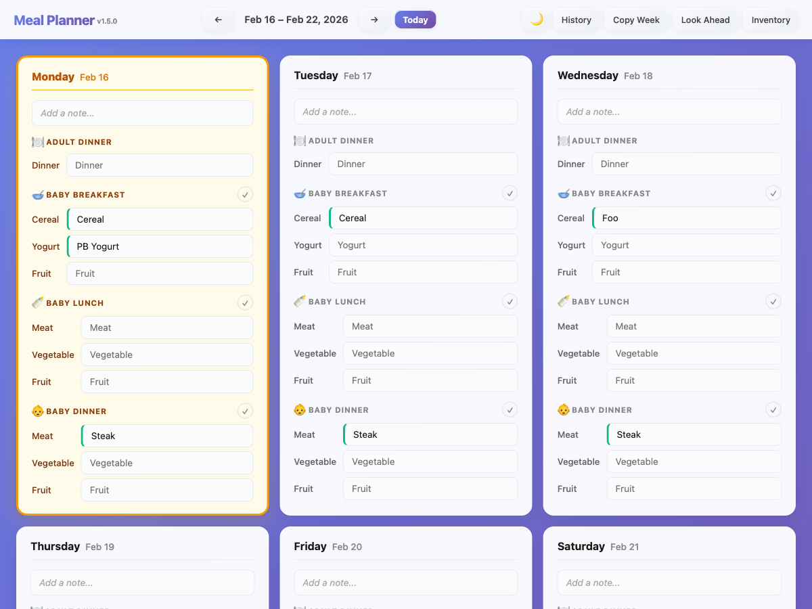
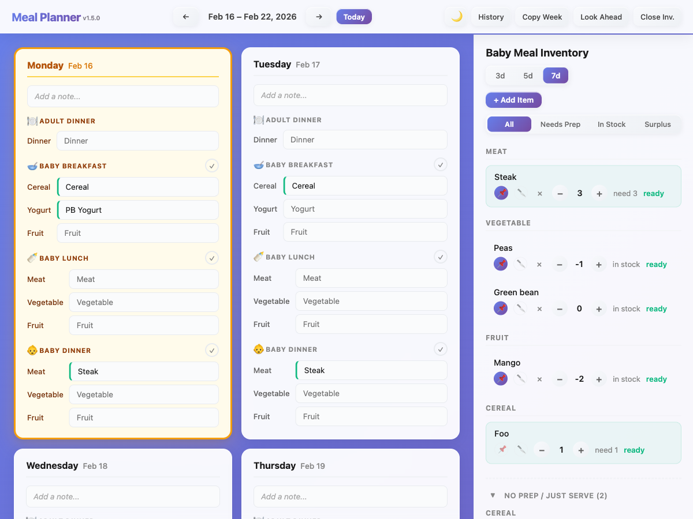

# Meal Planner

A weekly meal planning app for tracking baby and adult meals, with inventory management, a web interface, and MagTag e-ink display integration.



## Features

- **Weekly meal schedule** with day cards for adult dinner and baby breakfast/lunch/dinner
- **Inventory tracking** for baby meal ingredients with stock levels and prep status
- **Allocation indicators** showing whether each meal ingredient is covered by stock
- **Look-ahead view** spanning across weeks for planning upcoming days
- **Auto-complete** past meals to keep inventory counts accurate
- **Automated database backups** with GFS-lite retention (daily/weekly/monthly)
- **Dark mode** toggle
- **Copy week** to quickly duplicate a meal plan
- **MagTag e-ink display** integration for kitchen display



## Tech Stack

- **Backend**: Node.js + Express + TypeScript
- **Database**: SQLite via better-sqlite3 (WAL mode)
- **Frontend**: Vanilla JavaScript, HTML, CSS (no framework)
- **Testing**: Vitest + Supertest (API) + jsdom (frontend)
- **Security**: Helmet (headers) + express-rate-limit
- **Logging**: Pino (structured) + pino-roll (rotation, optional)
- **Deployment**: PM2 (process manager) + rsync to production
- **Hardware**: Adafruit MagTag e-ink display (CircuitPython)

## Getting Started

```bash
npm install
npm run build          # Compile TypeScript
npm start              # Start server (default port 3000)
```

For development with hot reload:

```bash
npm run start:dev
```

Seed the database with sample data:

```bash
npm run seed
```

## Commands

```bash
npm run build          # Compile TypeScript to dist/
npm start              # Start compiled server (default port 3000)
npm run start:dev      # Start dev server with hot reload (tsx)
npm run seed           # Seed database with sample data
npm run typecheck      # Run TypeScript type checker
npm test               # Run tests (vitest)
npm run test:watch     # Run tests in watch mode
npm run test:coverage  # Run tests with coverage report
npm run pm2:start      # Start with PM2 process manager
npm run pm2:logs       # View logs with pino-pretty formatting
npm run deploy         # Build and rsync to production server
```

## Project Structure

```
meal-planner/
├── src/                    # Server-side TypeScript source
│   ├── types/
│   │   └── index.ts        # Shared type definitions
│   ├── server.ts           # Express server entry point
│   ├── db.ts               # Database layer (SQLite)
│   ├── backup.ts           # Database backup with GFS-lite retention
│   ├── logger.ts           # Structured logging module
│   └── config.ts           # Centralized configuration
├── tests/                  # Test suite (Vitest)
│   ├── helpers/            # Shared test utilities
│   ├── integration/        # API + DB integration tests
│   ├── unit/               # Pure logic unit tests
│   └── frontend/           # jsdom-based frontend tests
├── scripts/                # Utility scripts
│   └── seed.ts             # Database seeder
├── dist/                   # Compiled JavaScript (gitignored)
├── public/                 # Frontend static files
│   ├── index.html          # Main HTML page
│   ├── app.js              # Frontend JavaScript (vanilla)
│   ├── style.css           # Styles (modern gradient design)
│   └── favicon.svg         # App icon
├── magtag/                 # MagTag e-ink display code
│   ├── code.py             # CircuitPython code for MagTag
│   └── settings.toml       # WiFi/server config
├── backups/                # Database backups (gitignored)
├── logs/                   # Log files (production)
├── meals.db                # SQLite database file
├── vitest.config.ts        # Test configuration
├── ecosystem.config.cjs    # PM2 process manager config
├── tsconfig.json           # TypeScript configuration
└── package.json
```

## API Endpoints

### Utility
- `GET /api/version` - Returns app version

### Schedule (used by frontend)
- `GET /api/weeks/:weekOf` - Get week data (creates if not exists)
- `PUT /api/weeks/:weekOf/days/:day` - Update a day's meals (day: 0-6)
- `PUT /api/weeks/:weekOf/days/:day/consume` - Mark baby meal as consumed
- `PUT /api/weeks/:weekOf/days/:day/unconsume` - Unmark baby meal as consumed
- `GET /api/weeks` - List all saved weeks
- `POST /api/weeks/:weekOf/copy` - Copy week to new date
- `DELETE /api/weeks/:weekOf` - Delete a week
- `GET /api/lookahead?days=N` - Raw day records for upcoming N days (3, 5, or 7)

### Inventory
- `GET /api/inventory?lookahead=N&today=YYYY-MM-DD` - Get inventory status
- `GET /api/inventory/allocation?weekOf=YYYY-MM-DD` - Per-meal stock coverage map
- `PUT /api/inventory/:ingredient` - Update stock, pin status, or prep attribute
- `POST /api/inventory` - Add manual inventory item
- `DELETE /api/inventory/:ingredient` - Delete a manual inventory item

### Backup
- `GET /api/backups` - List all backups with metadata
- `POST /api/backup` - Trigger manual backup (5-min cooldown, returns 429 if too soon)

### Public (for Home Assistant/MagTag)
- `GET /api/schedule/current` - Current week's meals
- `GET /api/schedule/upcoming` - Today + next 2 days
- `GET /api/schedule/:weekOf` - Specific week formatted for display

## Database Backups

Automated daily backups using SQLite's online backup API (safe during concurrent reads/writes).

- **Schedule**: Once on startup (if none exists for today) + every 24 hours
- **Retention**: GFS-lite policy — last 7 daily, 4 weekly, 3 monthly (~14 files max)
- **Manual trigger**: `POST /api/backup` with 5-minute cooldown
- **Storage**: `backups/` directory (configurable via `BACKUP_DIR` env var)
- **Filename format**: `meals-YYYY-MM-DDTHH-MM-SSZ.db`

## MagTag Display

The MagTag fetches from `/api/schedule/upcoming` and displays:
- Current day's meals in large text
- Button navigation: D (prev day), C (next day), A (refresh)
- Configured via `magtag/settings.toml`

## Timezone

All date calculations use **America/New_York** (US Eastern).
